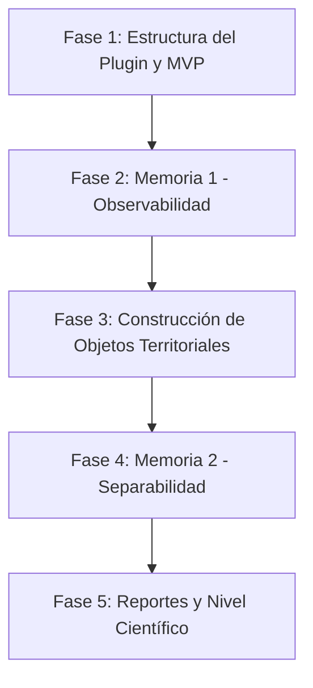

# Diagnóstico de Representación Territorial (DRT)
## Framework de Diagnóstico de Observabilidad Territorial para QGIS

**Diagnóstico de Representación Territorial (DRT)** es un plugin avanzado para QGIS diseñado no como una herramienta de clasificación tradicional, sino como un **Framework de Diagnóstico de Observabilidad Territorial**. Su objetivo principal es evaluar la capacidad representacional de los datos geográficos (raster y vectoriales) para determinar si permiten la construcción de objetos territoriales válidos y evaluar la separabilidad temática de las categorías bajo análisis.

---

## Arquitectura del Sistema

El plugin adopta una **arquitectura desacoplada** para garantizar la mantenibilidad, escalabilidad y la capacidad de realizar pruebas automatizadas sin depender del entorno de QGIS:

```
[ Capa de Datos (Raster + Vector) ]
                │
                ▼
  ┌───────────────────────────┐
  │         QGIS / UI         │  ◄── (Módulo /ui y /core: PyQGIS, PyQt5)
  └─────────────┬─────────────┘
                │  (Envío de datos limpios en formatos estándar)
                ▼
  ┌───────────────────────────┐
  │     Backend de Análisis   │  ◄── (Módulo /analysis: Pandas, Numpy, Scipy,
  │         (Puro)            │       Sklearn, GeoPandas, Shapely)
  └─────────────┬─────────────┘
                │
                ▼
  ┌───────────────────────────┐
  │   Generador de Reportes   │  ◄── (Módulo /reports: Jinja2, WeasyPrint)
  └───────────────────────────┘
```

*   **/analysis (Backend Puro):** Contiene la lógica matemática, estadística y geoespacial. **No tiene dependencias de `qgis.core` ni `qgis.gui`**. Esto permite que toda la lógica científica sea testeada mediante pruebas unitarias rápidas utilizando un intérprete estándar de Python.
*   **/ui y /core (Frontend QGIS):** Encargados de interactuar con la interfaz de QGIS, leer las capas seleccionadas por el usuario, convertirlas a estructuras de datos estándar (como DataFrames de Pandas, arrays de NumPy o GeoDataFrames) y enviarlas al backend.
*   **/reports:** Encargado de compilar los resultados matemáticos y las visualizaciones generadas en reportes interactivos HTML o documentos PDF listos para impresión.

---

## Stack Tecnológico Recomendado

El plugin se apoya en librerías de alto rendimiento del ecosistema de ciencia de datos espacial en Python:

| Componente | Librería | Propósito |
| :--- | :--- | :--- |
| **Núcleo GIS** | `PyQGIS` | Integración y visualización dentro de la aplicación QGIS. |
| | `GDAL` / `Rasterio` | Lectura, escritura y procesamiento eficiente de datos raster. |
| | `GeoPandas` / `Shapely` | Manipulación de datos vectoriales y operaciones geométricas avanzadas. |
| **Estadística / ML**| `scikit-learn` | PCA (Análisis de Componentes Principales), clustering (K-Means) y métricas de silueta. |
| | `SciPy` | Análisis estadístico (varianza, asimetría, curtosis, distancias de Mahalanobis). |
| | `PySAL` / `esda` | Autocorrelación espacial y cálculo del Índice Global de Moran. |
| | `scikit-image` | Extracción de texturas mediante matrices de co-ocurrencia de niveles de gris (GLCM). |
| **Visualización** | `Matplotlib` / `Seaborn` | Generación de gráficos estáticos para reportes (heatmaps, diagramas de caja, PCA scree plots). |
| | `Plotly` / `UMAP` | Visualización interactiva y reducción de dimensionalidad espacial (UMAP, t-SNE). |
| **Exportación** | `Jinja2` / `WeasyPrint` | Generación de reportes de diagnóstico profesionales en HTML y PDF. |

---

## Módulos del Framework

El sistema está organizado en 4 macro-módulos secuenciales:

### M0: Importación y Validación
*   Carga de pares de datos raster y vectoriales.
*   Validación básica de integridad de datos y detección de nulos.
*   Selección del campo de atributos que define las clases o categorías territoriales.

### M1: Memoria 1 — Observabilidad Territorial (Diagnóstico de Datos)
Evalúa si los datos de entrada son físicamente y espectralmente aptos para el análisis territorial.
1.  **Compatibilidad Espacial:** Comprobación de Sistemas de Referencia de Coordenadas (CRS), alineamiento de extensiones y cálculo del área efectiva común.
2.  **Cobertura Efectiva:** Porcentaje de polígonos vectoriales cubiertos por píxeles válidos del raster.
3.  **Resolución Observacional:** Relación de escala entre el tamaño del píxel raster y el área de los polígonos vectoriales.
4.  **Diagnóstico Espectral Inicial:** Estadísticas básicas por banda (media, varianza, asimetría, curtosis, entropía).
5.  **Análisis de Redundancia:** Correlación espectral interactiva (Pearson, Spearman) y PCA exploratorio.
6.  **Estructura Espacial:** Análisis de autocorrelación espacial (Moran's I) y variografía exploratoria (rango, sill, nugget).
7.  **Índice de Observabilidad Territorial (TOI):** Indicador sintético ponderado que puntúa la calidad representacional del dataset.

### M2: Construcción del Objeto Territorial
Transforma el raster y la geometría vectorial en una representación tabular enriquecida del territorio.
*   **Features Espectrales:** Estadísticas descriptivas de los píxeles contenidos en cada polígono.
*   **Features Texturales:** Métricas GLCM (contraste, homogeneidad, ASM, entropía) para capturar el patrón espacial interno.
*   **Features Variográficos:** Parámetros de variograma local por objeto territorial.
*   **Features Geométricos:** Área, perímetro, compactación, convexidad, elongación e índice de forma del polígono.
*   **Features Topológicos:** Relaciones espaciales con objetos vecinos (densidad vecinal, proximidad).

### M3: Memoria 2 — Separabilidad y Aprendibilidad (Diagnóstico del Feature Space)
Evalúa si el espacio de variables construido permite discriminar geográficamente las categorías.
1.  **Diagnóstico de Feature Space:** Análisis de redundancia multidimensional (Mutual Information) y estimación de la dimensionalidad intrínseca.
2.  **Clustering Exploratorio:** Agrupamiento no supervisado mediante K-Means con selección automática del número óptimo de clusters (Silueta, Davies-Bouldin, Codo).
3.  **Visualización Latente:** Proyección bidimensional interactiva del Feature Space usando UMAP y t-SNE, coloreando por clase real vs. cluster asignado.
4.  **Correspondencia Clase-Cluster:** Matrices de confusión cruzada y cálculo de entropía de mezclas intra-clase.
5.  **Solapamiento Interclase:** Cálculo de distancias estadísticas multivariantes (Mahalanobis y Bhattacharyya) entre categorías territoriales.
6.  **Territorial Learnability Index (TLI):** Índice ponderado de aprendibilidad territorial que evalúa la robustez del espacio de variables para clasificaciones futuras.

---

## Mapa de Ruta de Implementación (Paso a Paso)

Para garantizar un desarrollo ordenado y sostenible, el proyecto se dividirá en las siguientes fases consecutivas:



### Fase 1: Estructura Base del Plugin y MVP (Semanas 1-3)
*   [ ] Inicialización del repositorio y creación de la estructura de carpetas (`/core`, `/analysis`, `/ui`, `/reports`, `/tests`).
*   [ ] Creación del archivo de metadatos de QGIS (`metadata.txt`).
*   [ ] Diseño de la interfaz principal en Qt Designer (`main_dockwidget.ui`) con widgets para la selección de raster, vector y campo de clase.
*   [ ] Integración del cargador de capas del proyecto activo de QGIS en la UI.
*   [ ] Configuración del entorno de pruebas unitarias (`pytest`) para el módulo `/analysis`.

### Fase 2: Implementación de la Memoria 1 (Semanas 4-7)
*   [ ] Desarrollo del módulo de compatibilidad espacial (CRS y extensión efectiva de intersección).
*   [ ] Programación del cálculo de cobertura efectiva (porcentaje de polígonos válidos).
*   [ ] Implementación del cálculo de la resolución observacional (ratio pixel/polígono y gráficos de caja/histogramas).
*   [ ] Desarrollo de estadísticas espectrales básicas por banda y heatmap de correlaciones.
*   [ ] PCA global raster y generación del Scree Plot.
*   [ ] Cálculo del Moran's I y variograma básico.
*   [ ] Algoritmo de cálculo del Índice de Observabilidad Territorial (TOI).
*   [ ] Exportación básica de reportes en HTML/PDF para la Memoria 1.

### Fase 3: Construcción de Objetos Territoriales (Semanas 8-11)
*   [ ] Implementación de la extracción de descriptores espectrales estadísticos por polígono.
*   [ ] Integración de extracción de descriptores texturales (GLCM) mediante `scikit-image`.
*   [ ] Cálculo de descriptores geométricos de polígonos (área, perímetro, compactación, etc.) usando `Shapely`/`GeoPandas`.
*   [ ] Generación del exportador tabular: exportar la matriz de features construida a formato CSV o Geopackage.

### Fase 4: Implementación de la Memoria 2 (Semanas 12-15)
*   [ ] Programación de K-Means y algoritmos de selección del número óptimo de clusters.
*   [ ] Reducción de dimensionalidad con UMAP y visualización del espacio latente.
*   [ ] Creación del heatmap de correspondencia Clase-Cluster y cálculo de entropía intra-clase.
*   [ ] Implementación del cálculo de solapamiento interclase (distancias de Mahalanobis y Bhattacharyya).
*   [ ] Algoritmo de cálculo del Territorial Learnability Index (TLI).
*   [ ] Exportación de reportes de la Memoria 2.

---

## Instrucciones de Instalación para Desarrollo

*(Nota: Estas instrucciones se irán actualizando a medida que avance el desarrollo)*

1.  **Clonar el repositorio** en su entorno local:
    ```bash
    git clone https://github.com/andreesbotello/QGIS_DRT.git
    ```
2.  **Vincular el plugin a QGIS**:
    Para que QGIS reconozca el plugin en desarrollo, se recomienda crear un enlace simbólico de la carpeta `drt_plugin` en el directorio de plugins de su perfil de QGIS.
    *   **Windows (PowerShell Administrador):**
        ```powershell
        New-Item -ItemType SymbolicLink -Path "$env:APPDATA\QGIS\QGIS3\profiles\default\python\plugins\drt_plugin" -Value "C:\Ruta\A\Su\Proyecto\ProyectoFinal\drt_plugin"
        ```
3.  **Instalar dependencias de desarrollo** en su entorno de Python preferido para pruebas:
    ```bash
    pip install numpy scipy scikit-learn geopandas shapely rasterio matplotlib jinja2 pytest
    ```
4.  **Datos de prueba**:
    Los datos de prueba espacial (archivos vectoriales `.shp` y ráster `.tif`) requeridos para la ejecución y validación del plugin se deben ubicar en una carpeta denominada `Data/` en la raíz de este repositorio. Este directorio se encuentra excluido del control de versiones mediante el archivo `.gitignore` para evitar la carga de archivos pesados al repositorio.
5.  **Ejecución de Pruebas Unitarias con el Python de QGIS**:
    Para ejecutar las pruebas unitarias utilizando el entorno de Python integrado en QGIS (en Windows), se debe emplear el siguiente comando desde la consola PowerShell en la raíz del proyecto:
    ```powershell
    & "C:\Program Files\QGIS 3.44.10\apps\Python312\python3.exe" -m pytest drt_plugin/tests/
    ```
    En caso de no contar con `pytest` instalado en el intérprete de QGIS, este puede instalarse ejecutando:
    ```powershell
    & "C:\Program Files\QGIS 3.44.10\apps\Python312\python3.exe" -m pip install pytest
    ```

---

## Instrucciones para la Observación y Pruebas en QGIS

Para cargar, visualizar y validar el plugin directamente en la aplicación de escritorio de QGIS, siga los siguientes pasos:

### 1. Enlace del Plugin al Perfil de QGIS
QGIS busca los complementos de usuario en una ruta específica dentro de la carpeta de datos de la aplicación. Para evitar copiar manualmente los archivos en cada cambio, se debe crear un enlace simbólico (Symbolic Link) desde la terminal de PowerShell en modo Administrador:
```powershell
New-Item -ItemType SymbolicLink -Path "$env:APPDATA\QGIS\QGIS3\profiles\default\python\plugins\drt_plugin" -Value "c:\Users\bryan\Desktop\UPV\S2\3_DAS\ProyectoFinal\drt_plugin"
```

### 2. Activación del Plugin en QGIS
1. Inicie la aplicación **QGIS**.
2. Diríjase al menú superior: **Complementos** -> **Administrar e instalar complementos...** (Plugins -> Manage and Install Plugins...).
3. En la barra de búsqueda del diálogo, escriba: `Diagnóstico de Representación Territorial`.
4. Marque la casilla junto al nombre del plugin para activarlo.

### 3. Visualización y Flujo de Interfaz
1. Se añadirá un nuevo elemento en el menú superior: **Complementos** -> **DRT** -> **Diagnóstico de Representación Territorial (DRT)**. También se agregará un botón de acceso rápido en la barra de herramientas.
2. Al hacer clic en cualquiera de ellos, se desplegará el panel lateral derecho (**DockWidget**) con el título **DRT - Panel de Control**.
3. Cargue en su proyecto de QGIS cualquier capa ráster (`.tif`) y vectorial (`.shp` o GeoPackage) desde la carpeta `Data/`.
4. Compruebe que:
   * El selector **Capa Ráster** enlista los archivos ráster del proyecto.
   * El selector **Capa Vectorial** enlista las capas vectoriales del proyecto.
   * Al seleccionar una capa vectorial, el menú desplegable **Campo Clase** se actualiza automáticamente listando los atributos de la tabla asociada.
   * Al hacer clic en **Ejecutar Memoria 1**, se muestra un mensaje informativo que confirma los nombres de los elementos seleccionados.

### 4. Recarga de Código durante el Desarrollo (Plugin Reloader)
Para evitar reiniciar la aplicación QGIS tras cada modificación de código:
1. Instale el plugin **Plugin Reloader** desde el administrador de complementos oficial de QGIS.
2. En la barra de herramientas de QGIS, haga clic en el icono del Plugin Reloader (una flecha circular amarilla) para abrir su configuración.
3. Seleccione `drt_plugin` en la lista de plugins.
4. Cada vez que realice un cambio en el código fuente, haga clic en el botón de recarga rápida o presione el atajo de teclado configurado (por defecto, `F5`) para aplicar los cambios de inmediato en la sesión activa de QGIS.

---

## Directrices de Desarrollo de Inteligencia Artificial

El desarrollo de este software por parte de agentes de inteligencia artificial se rige por las siguientes normas estrictas para asegurar la calidad y profesionalismo del repositorio:
*   **Tono de comunicación**: Toda documentación, código fuente, comentarios y mensajes del agente deben redactarse en un tono estrictamente profesional, técnico y pragmático, libre de valoraciones emocionales, lenguaje coloquial o elementos innecesarios.
*   **Restricción de elementos no verbales**: Está prohibida la incorporación de emojis, signos de exclamación redundantes o decoraciones estilísticas informales tanto en la documentación como en las respuestas e interfaces asociadas al proyecto.
*   **Uso del terminal de comandos**: El agente evitará el uso deliberado o rutinario de comandos de terminal, limitándose exclusivamente a las operaciones explícitamente autorizadas por el usuario (como la inicialización o las pruebas de compilación/ejecución de test).
*   **Prohibición de archivos fuera del entorno**: El agente de IA no debe crear scripts o archivos temporales de prueba fuera del directorio raíz de este espacio de trabajo. En caso de requerir la creación de archivos de diagnóstico cortos, estos deben alojarse exclusivamente dentro de la carpeta `temp/` en la raíz del proyecto, la cual está excluida del control de versiones.
