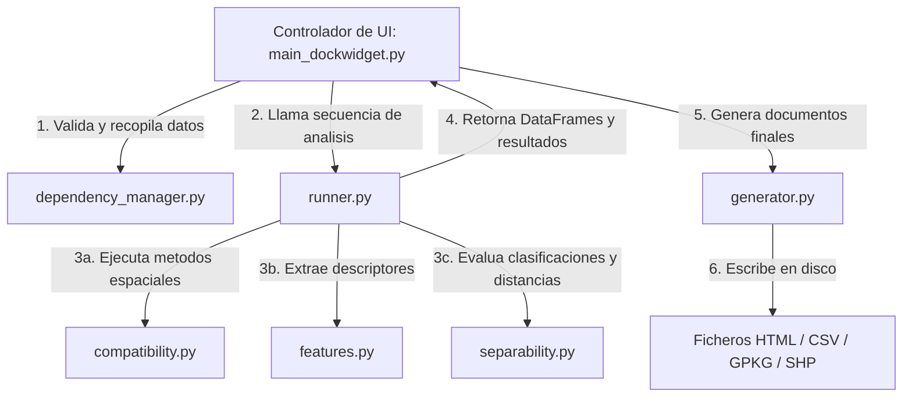

# Diagnóstico de Representación Territorial (DRT)
## Framework de Diagnóstico de Observabilidad Territorial para QGIS

**Diagnóstico de Representación Territorial (DRT)** es un plugin para QGIS desarrollado para evaluar la calidad y la capacidad representacional de conjuntos de datos geográficos (ráster y vectoriales), determinando si permiten construir objetos territoriales válidos y analizando la separabilidad de las categorías territoriales en estudio.

---

## ¿Qué hace el Plugin DRT?

El diagnóstico se divide en dos fases denominadas **Memorias**:

### Memoria 1: Observabilidad Territorial (Calidad del Dato)
Evalúa si los datos ráster y vectoriales de entrada son físicamente y espacialmente aptos y compatibles para un análisis territorial sólido:
*   **Compatibilidad Espacial:** Compara y alinea de forma automática los Sistemas de Referencia de Coordenadas (CRS) y calcula el área común de intersección geográfica.
*   **Resolución Observacional:** Determina la relación de escala física analizando la proporción de área entre el tamaño de píxel del ráster y la superficie de los polígonos vectoriales.
*   **Diagnóstico Espectral:** Genera métricas estadísticas descriptivas detalladas de todas las bandas del ráster (media, asimetría, curtosis, varianza, entropía).
*   **Análisis de Redundancia y Estructura:** Calcula la autocorrelación espacial global usando el **Índice de Moran** y el ajuste de semivariogramas empíricos, además de evaluar la redundancia espectral entre bandas mediante **PCA** (Componentes Principales).
*   **Índice TOI (Territorial Observability Index):** Genera una calificación sintética global (de 0 a 100) sobre la calidad de la observabilidad del dataset.

### Memoria 2: Separabilidad y Aprendibilidad Territorial (Feature Space)
Construye los denominados "Objetos Territoriales" y evalúa si el espacio de variables permite discriminar geográficamente tus categorías territoriales:
*   **Extracción de Descriptores (Features):** Extrae de forma automática para cada polígono atributos espectrales, geométricos (área, perímetro, compactación, elongación), texturales avanzados (**GLCM** en escala de grises locales) y relaciones de vecindad topológica.
*   **Clustering Exploratorio:** Agrupa los objetos territoriales utilizando K-Means y selecciona automáticamente el número óptimo de agrupaciones mediante el Método del Codo (recta secante de inercia).
*   **Visualización Latente (t-SNE):** Genera proyecciones bidimensionales interactivas para contrastar visualmente las agrupaciones K-Means y tus clases originales.
*   **Solapamiento Interclase:** Calcula distancias estadísticas multivariadas avanzadas de **Mahalanobis** y **Bhattacharyya** entre categorías para cuantificar el grado de confusión espectral.
*   **Índice TLI (Territorial Learnability Index):** Evalúa la robustez de tus datos para ser entrenados con algoritmos futuros de clasificación.

---

## Guía de Instalación del Complemento

El plugin incorpora un **sistema autogestionable de preparación de entorno**. No necesitas instalar librerías externas de Python manualmente antes de usarlo.

### Paso 1: Generar el archivo comprimido del plugin
Comprime la carpeta del plugin `drt_plugin` en un archivo llamado `drt_plugin.zip` (asegúrate de que la carpeta raíz interna del zip sea directamente `drt_plugin`).

### Paso 2: Instalar en QGIS
1.  Abre la aplicación de escritorio **QGIS**.
2.  Ve al menú superior: **Complementos** -> **Administrar e instalar complementos...**
3.  En el menú lateral izquierdo, haz clic en **Instalar a partir de ZIP**.
4.  Busca tu archivo `drt_plugin.zip` y haz clic en **Instalar complemento**.
5.  Una vez completado, asegúrate de marcar la casilla del plugin *"Diagnóstico de Representación Territorial (DRT)"* para activarlo.

### Paso 3: Auto-configuración de Componentes Científicos
La primera vez que abras el plugin, el sistema comprobará si tu entorno cuenta con las librerías matemáticas y espaciales requeridas (`geopandas`, `scikit-learn`, `scikit-image`, etc.).
1.  Si falta alguna librería, se abrirá un pop-up amigable con el mensaje: **"Preparando todo para usar el plugin..."**.
2.  El instalador descargará y configurará automáticamente las librerías necesarias en tu perfil de usuario de Python sin requerir permisos de administrador.
3.  Una vez finalizado el proceso de carga, el panel estará completamente listo para usarse.

---

## Guía de Uso del Plugin (Paso a Paso)

### 1. Cargar tus datos en el mapa de QGIS
Antes de abrir el plugin, carga tus capas en el panel de capas activo de tu proyecto en QGIS:
*   Una capa ráster continua (por ejemplo, una imagen de satélite `.tif` multiespectral).
*   Una capa vectorial poligonal (por ejemplo, un shapefile `.shp` o GeoPackage `.gpkg` con las parcelas de estudio).

### 2. Abrir el panel de control de DRT
Ve al menú superior de QGIS: **Complementos** -> **DRT** -> **Diagnóstico de Representación Territorial (DRT)** (o haz clic en el icono del plugin de la barra de herramientas). Se desplegará el panel lateral derecho **DRT - Panel de Control**.

### 3. Configurar y Ejecutar la Memoria 1 (Observabilidad)
1.  En la pestaña **Datos Iniciales**, selecciona la **Capa Ráster** y la **Capa Vectorial**.
2.  En **Campo Clase**, selecciona la columna de la tabla de atributos de tu vector que define la clase territorial (ej. *cultivo*, *bosque*, *urbano*).
3.  Indica una **Carpeta de Salida** donde se guardarán los resultados y un **Nombre de Archivo Base** (ej. *Estudio_Territorial*).
4.  Si deseas incluir métricas basadas en índices de vegetación o agua, marca la casilla **Calcular Índices Espectrales (NDVI/NDWI)** y configura las bandas correspondientes a tu sensor (se incluyen presets automáticos para Landsat 8/9 y Sentinel-2).
5.  Haz clic en **Ejecutar Memoria 1 (Observabilidad)**.
    *   Puedes seguir el proceso en tiempo real en la pestaña **Consola**.
    *   Al finalizar, se genera un reporte en formato HTML y un archivo CSV con los datos de los píxeles de cada objeto.

### 4. Configurar y Ejecutar la Memoria 2 (Separabilidad)
1.  Dirígete a la pestaña **Objeto Territorial**.
2.  En **Datos de Entrada (CSV Fase 1)**, el plugin cargará automáticamente la ruta del archivo CSV generado en el paso anterior.
3.  Indica si deseas aplicar el algoritmo de depuración de colinealidad (opción recomendada *No - Depurar* para eliminar variables redundantes correlacionadas).
4.  Haz clic en **Ejecutar Memoria 2 (Separabilidad)**.
    *   El motor analizará las texturas locales (GLCM), variogramas de objetos, geometrías y vecindades.
    *   Posteriormente evaluará K-Means, proyecciones en 2D t-SNE y distancias estadísticas.
5.  Al finalizar, el plugin generará el reporte de aprendibilidad **HTML** de la Memoria 2 y mostrará la puntuación **TLI** (Territorial Learnability Index) en la pantalla de control.

*Nota: Los reportes generados en formato HTML se pueden abrir en cualquier navegador web y exportar a PDF.

---

## Arquitectura del Plugin

El plugin DRT sigue un diseño desacoplado que separa la interfaz gráfica de usuario en QGIS de los algoritmos de cálculo matemático y procesamiento espacial (backend). Esto asegura la modularidad del código y permite probar la lógica de procesamiento de forma independiente a la interfaz gráfica.

### Estructura de Directorios

La estructura de carpetas de `drt_plugin` se organiza de la siguiente manera:

*   **`ui/` (Frontend / Interfaz de Usuario)**:
    *   `main_dockwidget.ui`: Interfaz de usuario diseñada en QtDesigner (formato XML).
    *   `main_dockwidget.py`: Controlador de la UI que vincula los eventos y maneja la lógica de las pestañas principales.
    *   `dependency_dialog.ui` / `dependency_dialog.py`: Diálogo y lógica para la instalación e indicación del progreso de dependencias científicas ausentes.
*   **`analysis/` (Backend Analítico)**:
    *   Es un módulo escrito en Python puro, completamente independiente de las APIs de QGIS (`qgis.core` o `qgis.gui`).
    *   `runner.py`: Coordinador y tubería (pipeline) secuencial que ejecuta los diagnósticos analíticos.
    *   `compatibility.py`: Validación espacial (comprobación de CRS, extensión y alineamiento).
    *   `spectral.py`: Estadísticas descriptivas de bandas y PCA global.
    *   `spatial.py`: Autocorrelación espacial global (Índice de Moran) y modelado de semivariogramas empíricos.
    *   `features.py`: Extracción de descriptores del objeto territorial (espectrales, GLCM, variografía local, geometría y topología).
    *   `separability.py`: Análisis de colinealidad, clustering K-Means, visualización latente t-SNE, distancias interclase y cálculo del TLI.
    *   `indexes.py`: Lógica para calcular el índice TOI.
*   **`reports/` (Generador de Reportes)**:
    *   `generator.py`: Convierte las estructuras de datos recopiladas en los diagnósticos en páginas HTML dinámicas que contienen tablas de datos y gráficos vectoriales embebidos en Base64.
*   **`core/` (Utilidades del Entorno)**:
    *   `dependency_manager.py`: Verifica la presencia de dependencias (`geopandas`, `scikit-learn`, `scipy`, etc.) y realiza su instalación silenciosa usando `pip install --user`.

### Interacción entre Componentes

